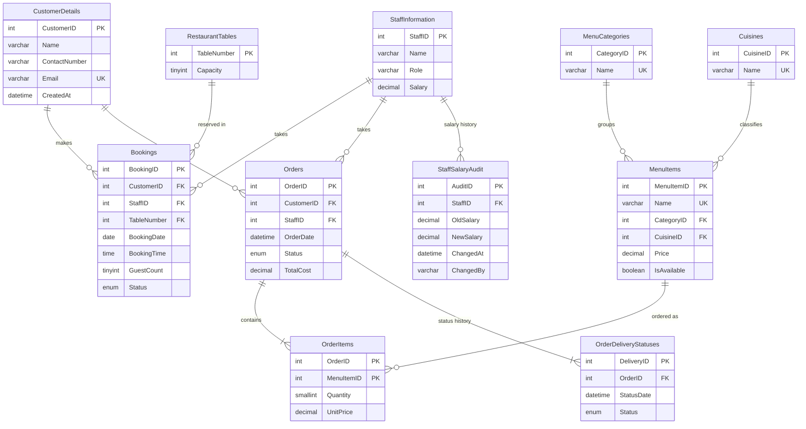
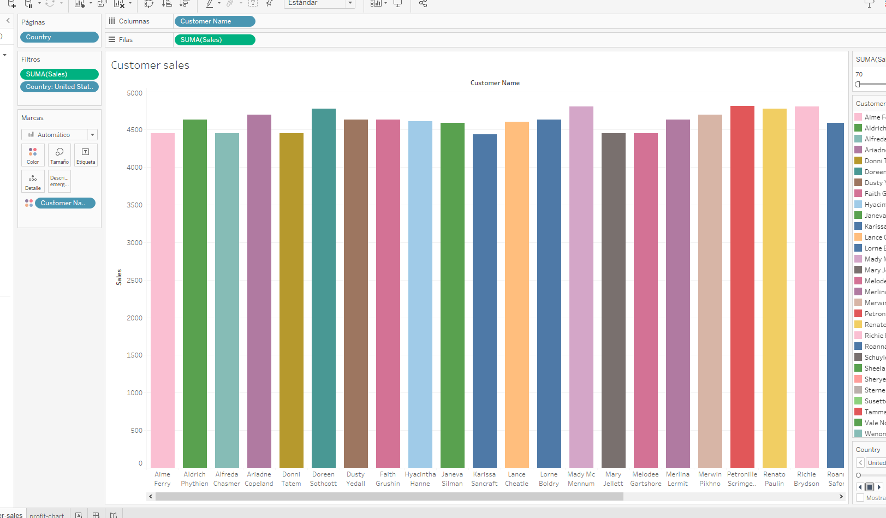
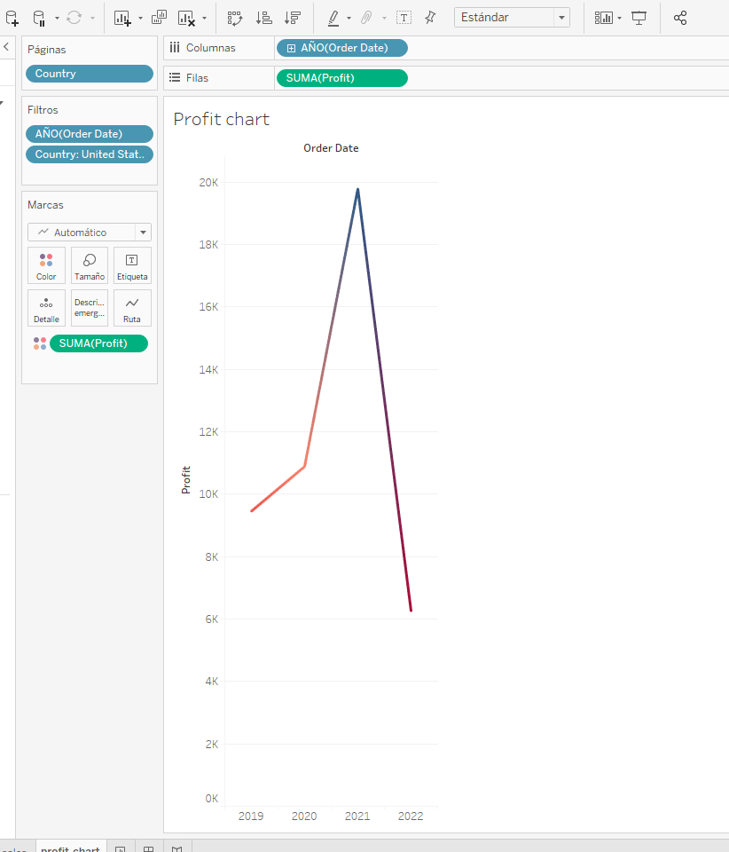
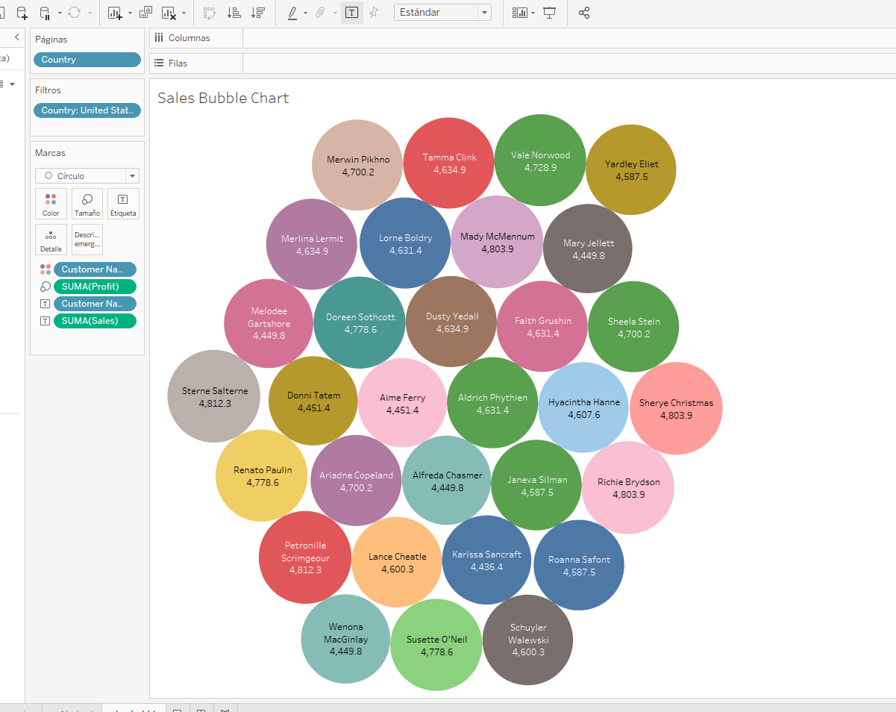
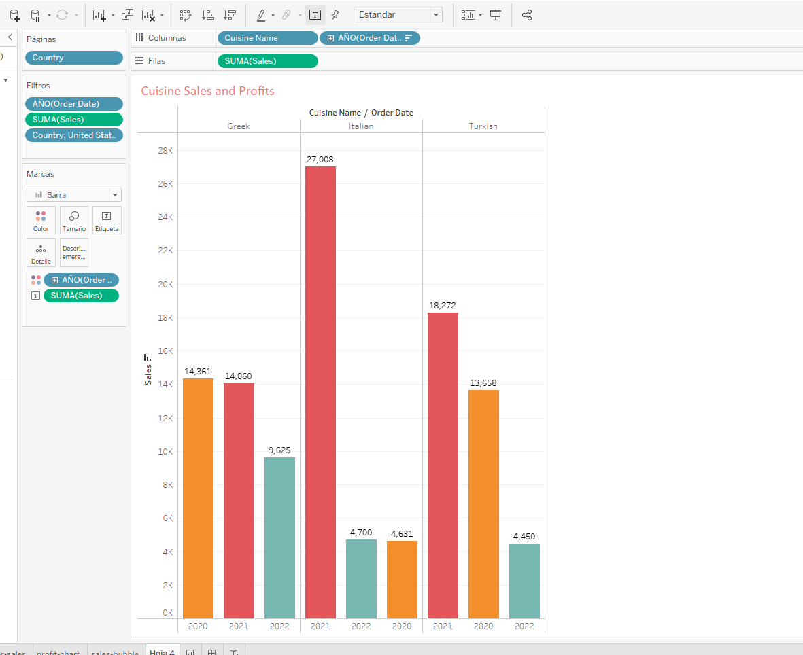
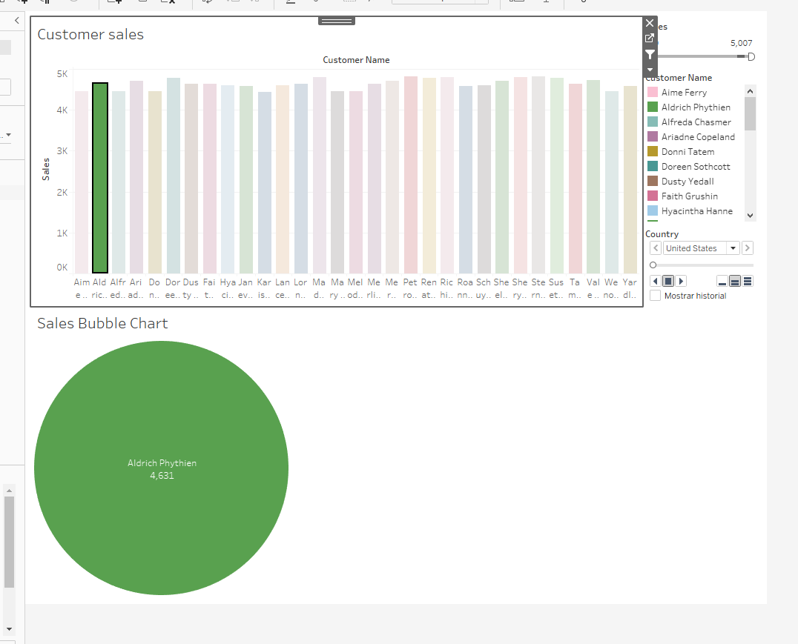

# Little Lemon Restaurant Database

A MySQL 8 database for a fast-food restaurant: customers, staff, menu, table bookings and orders, with the business rules enforced inside the database and a Tableau workbook for sales analysis.

Built as the capstone of the **Meta Database Engineer Certificate**. The project starts from the course capstone brief; the schema design, stored procedures, triggers, analytics, indexing and security layer were developed further for this version.

## Contents

- [Features](#features)
- [Entity-Relationship Diagram](#entity-relationship-diagram)
- [Repository Layout](#repository-layout)
- [Setup](#setup)
- [Usage](#usage)
- [Design Decisions](#design-decisions)
- [Analytics](#analytics)
- [Index Performance](#index-performance)
- [Security](#security)
- [Testing](#testing)
- [Known Limitations](#known-limitations)
- [Data Analysis with Tableau](#data-analysis-with-tableau)

## Features

| Area | What is included |
|------|------------------|
| Schema | 11 normalised InnoDB tables with primary keys, foreign keys (explicit `ON DELETE` / `ON UPDATE` rules), `UNIQUE` and `CHECK` constraints |
| Integrity | Double booking is blocked by a unique key; order totals are kept in sync by triggers; order prices are frozen at purchase time |
| Procedures | 9 stored procedures with input validation, transactions and `SIGNAL` based error messages |
| Triggers | 8 triggers: capacity check, availability check, order total maintenance, status history, salary audit |
| Views | 6 views for reporting |
| Analytics | 10 queries using CTEs and window functions (`LAG`, `RANK`, `DENSE_RANK`, `NTILE`, running totals) |
| Performance | Composite indexes verified with `EXPLAIN`, using invisible indexes for a before/after comparison |
| Security | Three roles (manager, waiter, analyst) with least-privilege grants |
| Data | Hand-written sample data plus a deterministic generator for about 5,000 orders, 10,000 order lines and 3,000 bookings |

## Entity-Relationship Diagram

The MySQL Workbench model is saved at [`sql/00_ER-structure.mwb`](./sql/00_ER-structure.mwb). The diagram below shows the same schema in Mermaid, which GitHub renders directly.



## Repository Layout

```
.
├── LittleLemonDB.sql        Complete database in one file (sql/01 to sql/07 in order)
├── sql/
│   ├── 00_ER-structure.mwb  MySQL Workbench EER model
│   ├── 01_schema.sql        Tables, constraints, indexes
│   ├── 02_seed_data.sql     Menu, staff, tables and a small hand-written dataset
│   ├── 03_bulk_data.sql     Deterministic generated data for analytics
│   ├── 04_views.sql         Reporting views
│   ├── 05_procedures.sql    Stored procedures
│   ├── 06_triggers.sql      Triggers
│   ├── 07_security.sql      Roles and grants
│   ├── 08_analytics.sql     CTE and window function queries
│   └── 09_performance.sql   EXPLAIN comparisons
├── LittleLemon_data.xlsx    Data extract used by the Tableau workbook
├── tableau.twb              Tableau workbook
└── Images/                  Tableau screenshots
```

## Setup

Requires MySQL 8.0 or later (the schema uses `CHECK` constraints, roles, invisible indexes, `JSON_TABLE` and window functions).

**Command line**

```bash
mysql -u root -p < LittleLemonDB.sql
```

**MySQL Workbench**

1. `Server` > `Data Import` > `Import from Self-Contained File`, choose `LittleLemonDB.sql`.
2. Leave the default target schema empty and click `Start Import`.

The script drops and recreates the `LittleLemonDB` database, so running it again resets everything.

`LittleLemonDB.sql` is the contents of `sql/01_schema.sql` through `sql/07_security.sql` in order. You can run those files one by one instead if you prefer.

`08_analytics.sql` and `09_performance.sql` are queries to run after the import and are not part of the dump.

## Usage

### Bookings

```sql
-- Is table 5 free on a given evening?
CALL CheckBooking('2030-06-15', '19:00:00', 5);

-- Which tables seat 6 people and are free?
CALL GetAvailableTables('2030-06-15', '19:00:00', 6);

-- Book it. The new id is returned through the OUT parameter.
CALL AddBooking(3, 6, 5, '2030-06-15', '19:00:00', 4, @booking_id);
SELECT @booking_id;

-- Reschedule or cancel
CALL UpdateBooking(@booking_id, '2030-06-16', '20:00:00');
CALL CancelBooking(@booking_id);
```

Invalid requests fail with a readable message instead of a raw constraint error:

```
CALL AddBooking(3, 6, 5, '2030-06-15', '19:00:00', 4, @id);   -- table already taken
ERROR 1644 (45000): Table is already booked for that date and time

CALL AddBooking(3, 6, 1, '2030-06-20', '19:00:00', 4, @id);   -- table 1 seats 2
ERROR 1644 (45000): Guest count exceeds table capacity
```

### Orders

```sql
-- Items are passed as JSON. Prices are read from the menu.
CALL PlaceOrder(2, 2,
    '[{"menu_item_id": 1, "quantity": 2}, {"menu_item_id": 6, "quantity": 2}]',
    @order_id);

-- Move it through the kitchen, then deliver
CALL UpdateOrderStatus(@order_id, 'Preparing');
CALL UpdateOrderStatus(@order_id, 'Out for delivery');
CALL UpdateOrderStatus(@order_id, 'Delivered');

-- Or cancel an order that has not been delivered (the row is kept)
CALL CancelOrder(@order_id);

-- Largest quantity of one item in a single order line (NULL = all items)
CALL GetMaxQuantity(1);
```

### Views

| View | Purpose |
|------|---------|
| `OrdersView` | Orders with more than two items |
| `OrderDetailsView` | One row per order line with customer, menu item and category |
| `PopularMenuItemsView` | Items selling more than the average item |
| `MenuItemSalesView` | Units and revenue per item, category and cuisine |
| `DailyRevenueView` | Orders and revenue per day |
| `UpcomingBookingsView` | Confirmed bookings from today onwards |

## Design Decisions

**Double booking is prevented by the database, not by the procedure.** `Bookings` has a unique key on `(TableNumber, BookingDate, BookingTime, SlotLock)`. `SlotLock` is a generated column that is `NULL` for cancelled bookings, so cancelled slots do not block new bookings while two live bookings can never share a slot. A check-then-insert in a procedure would have a race condition between the check and the insert; the unique key does not.

**Orders are header plus lines.** `Orders` holds one row per order and `OrderItems` one row per item, so an order can contain several dishes. `OrderItems.UnitPrice` copies the menu price at order time, so later menu price changes do not rewrite history.

**`Orders.TotalCost` is derived data kept consistent by triggers.** Insert, update and delete triggers on `OrderItems` recompute it, so it cannot drift from the lines.

**Money uses `DECIMAL(n,2)`.** Prices and totals keep cents.

**Menu data is normalised.** Categories and cuisines are lookup tables referenced by `MenuItems`, so adding a cuisine or category is a row insert, not a schema change.

**Soft cancellation.** Cancelled orders and bookings stay in the tables with a `Cancelled` status. Revenue figures exclude them and the status history is preserved.

**Status history is automatic.** Triggers write every order status change to `OrderDeliveryStatuses`, so the application never has to remember to log it.

**Procedures validate and fail clearly.** Every procedure checks its inputs, uses transactions where more than one statement is involved, and raises a `SIGNAL` with a message the caller can show. Unexpected errors roll back and are re-raised.

**Reference rules use constraints.** `CHECK` constraints cover roles, salaries, prices, quantities, guest counts and email format; foreign keys use `RESTRICT` for business records and `CASCADE` for dependent child rows.

## Analytics

`sql/08_analytics.sql` contains ten queries. A few examples of what they show with the generated data:

- **Monthly revenue** with month-over-month growth (`LAG`) and a running total (`SUM() OVER`)
- **Top customers** ranked with `RANK()` and segmented into spend quartiles with `NTILE(4)`
- **Best sellers per category** using `DENSE_RANK() OVER (PARTITION BY ...)`
- **Cuisine revenue share** as a percentage of total using a window over an aggregate
- **Table utilisation**, **busiest weekday**, **repeat-customer rate**, **average days between orders** and **cancellation rates**

## Index Performance

`sql/09_performance.sql` hides an index with `ALTER INDEX ... INVISIBLE`, runs `EXPLAIN`, makes it visible again and runs `EXPLAIN` a second time. On the generated data (about 5,000 orders):

| Query | Without index | With index |
|-------|---------------|------------|
| Orders in a one-week range | Full table scan, cost ~505 | Index range scan on `idx_Orders_OrderDate` |
| One customer's order history, newest first | Full scan plus sort, cost ~505 | Index lookup on `idx_Orders_Customer_Date`, no sort, cost ~8.8 |
| Double-booking check | n/a | Covering lookup on the unique slot key |

The composite index `(CustomerID, OrderDate)` serves both the filter and the `ORDER BY`, which is why the sort disappears.

## Security

`sql/07_security.sql` defines three roles:

| Role | Can do |
|------|--------|
| `ll_manager` | Read and write all tables, execute all procedures |
| `ll_waiter` | Execute the booking and order procedures, read the menu and tables. Cannot read staff salaries or write to tables directly |
| `ll_analyst` | Read-only access to orders, menu, bookings and the reporting views. No access to customer contact details or staff data |

Procedures run with the definer's rights, so a waiter can place an order through `PlaceOrder` without holding `INSERT` on `Orders`.

```sql
CREATE USER 'asha'@'localhost' IDENTIFIED BY '<password>';
GRANT 'll_waiter' TO 'asha'@'localhost';
SET DEFAULT ROLE 'll_waiter' TO 'asha'@'localhost';
```

## Testing

The project was verified on MySQL 8.0 by loading `LittleLemonDB.sql` into an empty server and checking:

- Every procedure on its success path and on each validation failure (past dates, unknown ids, double booking, over-capacity, empty or invalid item lists, illegal status transitions, cancelling a delivered order)
- That `Orders.TotalCost` equals the sum of its lines for every order after the bulk load and after new orders
- Constraint violations (duplicate email, malformed email)
- Salary changes producing audit rows
- Role privileges: a waiter can call `PlaceOrder` but cannot read `StaffInformation` or insert into `Orders`; an analyst can read revenue views but cannot read customers or delete rows

## Known Limitations

- Bookings use fixed start times and a table is held for one slot, not for a duration, so overlapping bookings with different start times are allowed.
- There is no payment, tax or discount model. `TotalCost` is the sum of line prices.
- Orders are not linked to bookings (delivery and dine-in are not distinguished).
- The generated dataset is synthetic and evenly distributed, so analytics results show the queries working rather than real restaurant behaviour.

## Data Analysis with Tableau

A Tableau workbook with charts and dashboards for sales analysis. Download the workbook [here](./tableau.twb).

The workbook reads from `LittleLemon_data.xlsx`, a separate data extract. It does not connect to the MySQL database, so it is independent of the SQL files. When opening it, Tableau may ask you to point to the location of `LittleLemon_data.xlsx`.

### Customers sales


### Profit chart


### Sales Bubble Chart


### Cuisine Sales and Profits


### Dashboard
